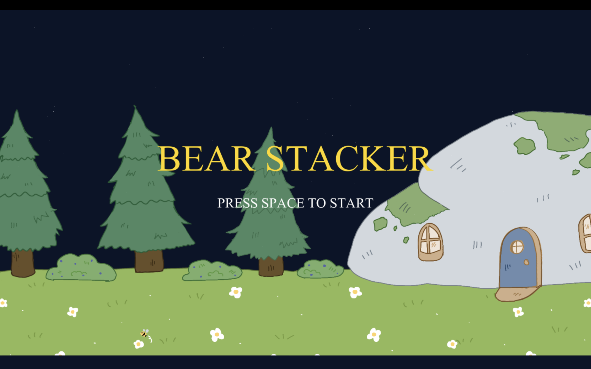
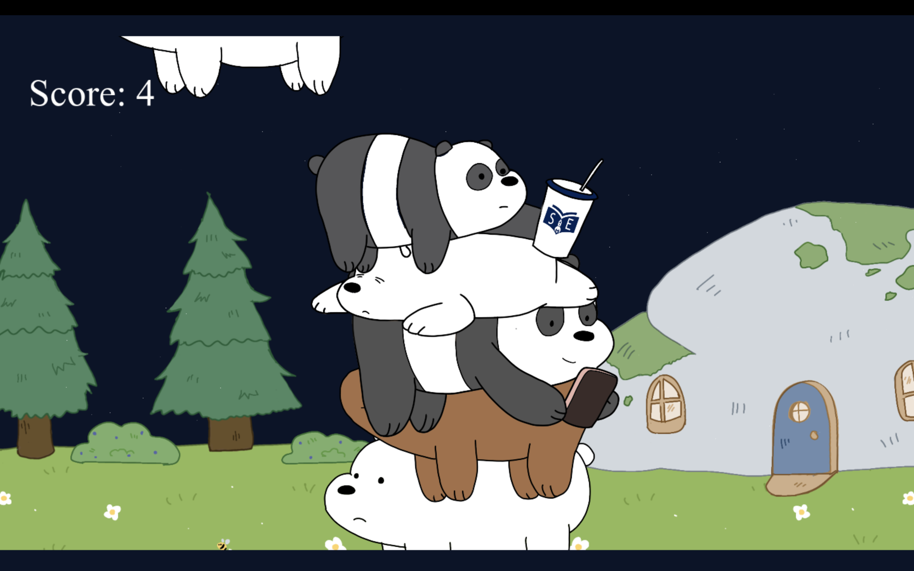

Bear Stacker - 2D Physics Game
## Game Preview

Introduction
A simple 2D stacking game where players balance bears to achieve the highest score. This project demonstrates my ability to implement game logic and resource management using C++.

Key Features
Physics-based Mechanics: Implementing object balance and stacking logic.

Resource Management: Handling assets like sounds, fonts, and textures efficiently.

Build System: Managed with CMake for cross-platform compatibility.

Technologies Used
Programming Language: C++ (Standard 17).

Build System: CMake.

Development Environment: Visual Studio Code.

How to Build
Clone the repository.

Run cmake . to generate the build files.

Compile and run the executable.
